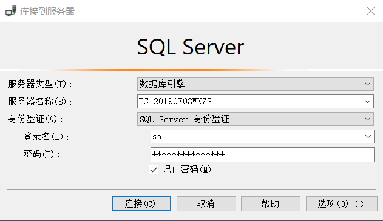
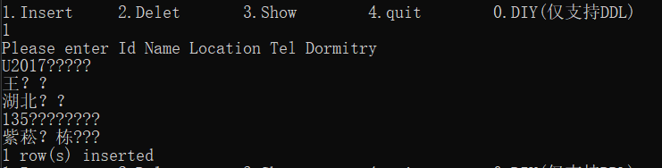
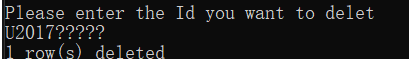
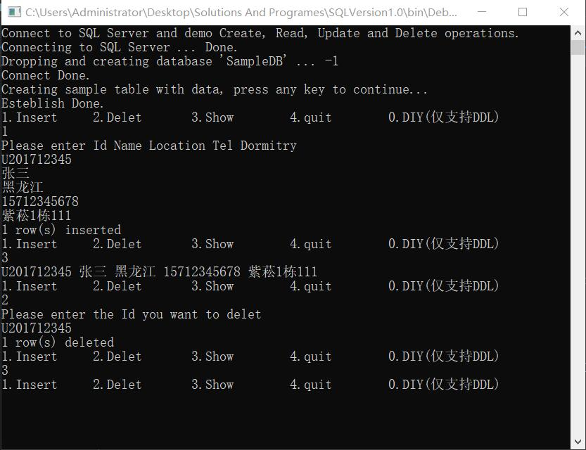
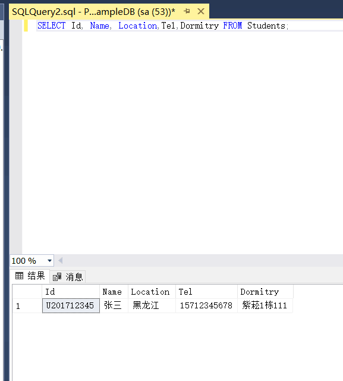

**<center><font size=6>学生信息管理demo程序说明</font></center>**

### 功能设想
实现数据库与控制台连接，并可以通过控制台对数据库进行一定的增减功能
并且可以查询全部学生信息。

### 代码

#### 链接数据库
创建实例builder初始化其信息以与数据库连接
```
SqlConnectionStringBuilder builder = new SqlConnectionStringBuilder();
                builder.DataSource = "PC-20190703WKZS";   
                builder.UserID = "sa";              
                builder.Password = "116752341";      
                builder.InitialCatalog = "master";
```

包含服务器名称、登录名和密码
#### 创建数据库
创建一个包含学生学号，姓名，住址，电话，宿舍信息的表。通过将DDL语言传递到字符串sql中再通过SqlCommand实现语句。
```
                    StringBuilder sb = new StringBuilder();
                    sb.Append("USE SampleDB ");
                    sb.Append("CREATE TABLE Students ( ");
                    sb.Append(" Id NVARCHAR(50) NOT NULL PRIMARY KEY, ");
                    sb.Append(" Name NVARCHAR(50), ");
                    sb.Append(" Location NVARCHAR(50), ");
                    sb.Append(" Tel NVARCHAR(50),");
                    sb.Append(" Dormitry NVARCHAR(50)");
                    sb.Append("); ");
                    sql = sb.ToString();
                    using (SqlCommand command = new SqlCommand(sql, connection))
                    {
                        command.ExecuteNonQuery();
                        Console.WriteLine("Esteblish Done.");
                    }
```
#### 实现插入功能
通过用户依次输入的方式来获取各个信息并通过INSERT语句将其输入至数据库
```
cmd1 = "INSERT Students (Id,Name, Location,Tel,Dormitry) VALUES (@Id,@name, @location,@Tel,@Dormitry);";
using (SqlCommand command = new SqlCommand(cmd1, connection))
                                {
                                    string Id, strnam, stradd, strtel, strdom;
                                    Id = Console.ReadLine();
                                    strnam = Console.ReadLine();
                                    stradd = Console.ReadLine();
                                    strtel = Console.ReadLine();
                                    strdom = Console.ReadLine();
                                    command.Parameters.AddWithValue("@Id", Id);
                                    command.Parameters.AddWithValue("@name", strnam);
                                    command.Parameters.AddWithValue("@location", stradd);
                                    command.Parameters.AddWithValue("@Tel", strtel);
                                    command.Parameters.AddWithValue("@Dormitry", strdom);
                                    int rowsAffected = command.ExecuteNonQuery();
                                    Console.WriteLine(rowsAffected + " row(s) inserted");
                                }
```

#### 实现删除功能
仅通过学号来删除对应学号学生的全部信息，借用DELET语句。
```
cmd2 = "DELETE FROM Students WHERE Id = @Id;";
using (SqlCommand command = new SqlCommand(cmd2, connection))
                                {
                                    string Id;
                                    Id = Console.ReadLine();
                                    command.Parameters.AddWithValue("@Id", Id);
                                    int rowsAffected = command.ExecuteNonQuery();
                                    Console.WriteLine(rowsAffected + " row(s) deleted");
                                }
```

#### 实现展示功能
借助sqldatareader从数据库中读取信息
```
cmd3 = "SELECT Id, Name, Location,Tel,Dormitry FROM Students;";
using (SqlCommand command = new SqlCommand(cmd3, connection))
                                {

                                    using (SqlDataReader reader = command.ExecuteReader())
                                    {
                                        while (reader.Read())
                                        {
                                            Console.WriteLine("{0} {1} {2} {3} {4}", reader.GetString(0), reader.GetString(1), reader.GetString(2), reader.GetString(3), reader.GetString(4));
                                        }
                                    }
                                }
```

### 功能演示
<font size=3>控制台端


SQL Server Management System


</font>
### 缺点说明
程序忽略了许多数据库的操作，例如条件查询，多表联立。且由于未考虑到用户输入的随机性，可能会存在无意义的个体。这些是程序缺点，也是改进方向。