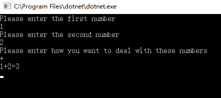

# 简单计算器

## 功能设想
实现在控制台输入两个数以及加减乘除运算符进行计算输出结果。
## 项目代码及测试
### 代码
``` c#
static void Main(string[] args)
        {
            int First,Second;
            string FirstPrototype,SecondPrototype;
            Console.WriteLine("Please enter the first number:");
            FirstPrototype=Console.ReadLine();
            Console.WriteLine("Please enter the second number:");
            SecondPrototype = Console.ReadLine();
            Second = Int32.Parse(SecondPrototype);
            First = Int32.Parse(FirstPrototype);
            Console.WriteLine("Please enter how you want to deal with these numbers");
            int Calculate,Output;
            Calculate = Console.Read();
            if (Calculate == '+') 
            {
                Output = First + Second;
                Console.WriteLine(First+"+"+Second+"="+Output);
            }
            if (Calculate == '-')
            {
                Output = First - Second;
                Console.WriteLine(First + "-" + Second + "=" + Output);
            }
            if (Calculate == '*')
            {
                Output = First * Second;
                Console.WriteLine(First + "*" + Second + "=" + Output);
            }
            if (Calculate == '/')
            {
                Output = First / Second;
                Console.WriteLine(First + "/" + Second + "=" + Output);
            }
        }
```
### 测试
输入两个数和运算符号，例子如下：


## 客户反馈
我们衷心地接受来自客户的真实反馈，以便于我们进行更好的改进，请将意见或建议发送至我们的邮箱
Email<1428805264@qq.com>
## 作者
电气中英1701王佳松  
学号：U201715771

