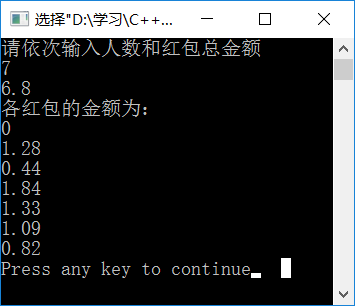

# **发红包程序**
本程序给出了在知晓总红包金额数以及红包个数的情况下，随机生成的各个红包金额，达到模仿微信QQ发红包程序的目的。
## 程序优势
给出的金额绝对随机，操作方便。
## 前提条件
- 您的计算机需要装好C++6.0或其以上版本的编译器，或者装有配置了C++的[Visual Studio](https://developer.microsoft.com/en-us/windows/downloads)。
- 您需要输入红包个数以及总金额。
## 客户反馈
我们衷心地接受来自客户的真实反馈，以便于我们进行更好的改进，请将意见或建议发送至我们的邮箱(495309540@qq.com)
## 项目代码及测试
### 代码如下：
~~~C++
#include<iostream>
using namespace std;
int main()
{ 
 int n,i,m;
 double t;
 cout<<"请依次输入人数和红包总金额"<<endl;
 cin>>n>>t;
 double p=0,q=0,s[1000],x[1000];
 for(i=0;i<n;i++)
 {
   s[i]=rand();
   p+=s[i];
 }
 for(i=0;i<n-1;i++)
 {m=100*(s[i]/p)*t;
  x[i]=m/100.0;
  q+=x[i];}
 x[n-1]=t-q;
 cout<<"各红包的金额为："<<endl;
 for(i=0;i<n;i++)
    cout<<x[i]<<endl;
 return 0;
}
~~~
### 测试
输入不同的总金额和红包个数，可得到不同的结果，例如下：
输入红包个数为7，总金额为6.8，得到如下图所示结果： 
## 作者
电气中英1702班 胡瀚 学号：U201715677
## license
Copyright (c) Microsoft Corporation. All rights reserved.
## 致谢
全体盛安德软件训练营师生
